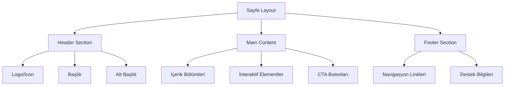
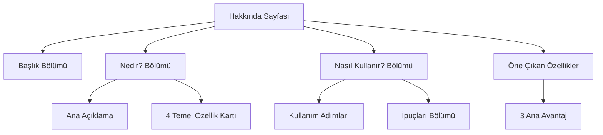
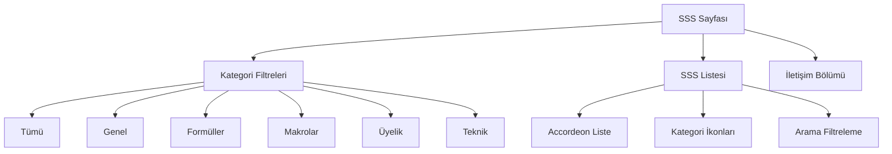
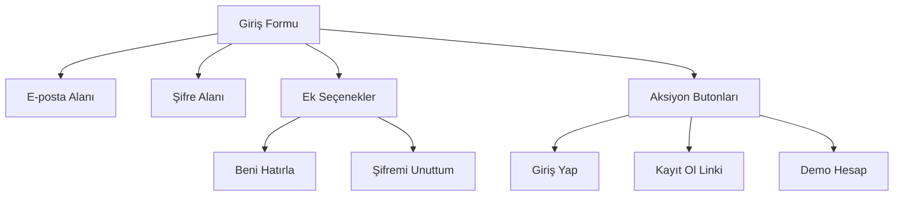
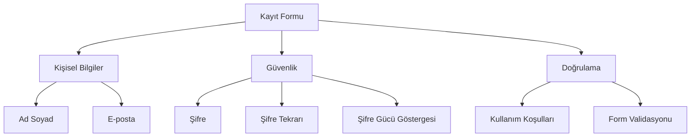
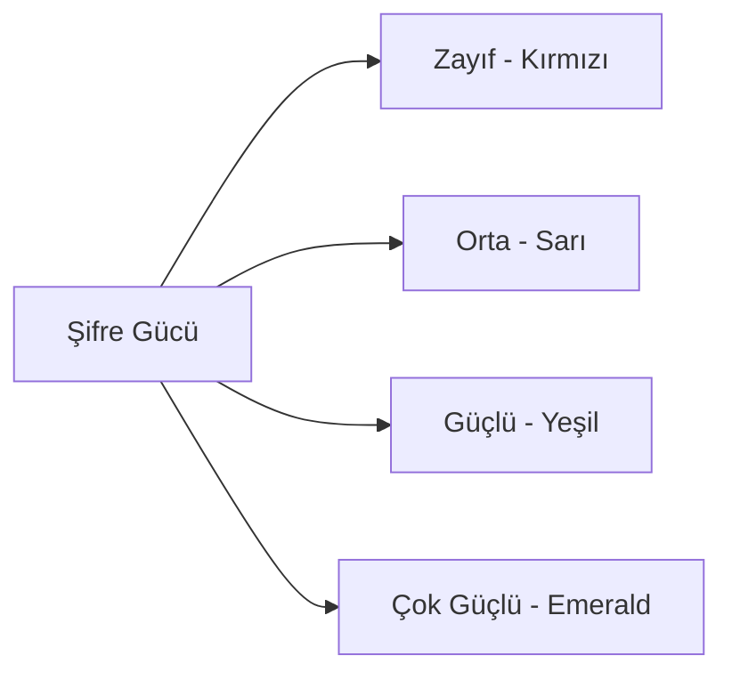
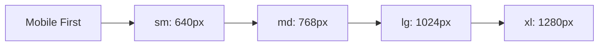

# Excel Formül Yardımcısı - Sayfa İçerikleri Tasarım Dökümanı

## 1. Genel Bakış

Bu döküman, Excel Formül Yardımcısı uygulamasının Hakkında, SSS, Giriş ve Kaydol sayfalarının içerik yapısını ve tasarım özelliklerini detaylandırır. Uygulama, yapay zeka destekli Excel formül ve makro oluşturma hizmeti sunan Türkçe odaklı bir web platformudur.

### 1.1 Hedef Kitle
- Excel'de yeni olan kullanıcılar
- Orta seviye Excel kullanıcıları
- İleri düzey profesyoneller
- Türkçe Excel tercih eden kullanıcılar
- Veri analistleri ve iş profesyonelleri

### 1.2 Ana Özellikler
- AI destekli formül üretimi
- VBA makro oluşturma
- Türkçe doğal dil işleme
- Excel dosya analizi
- Canlı formül önizleme

## 2. Sayfa Mimarisi

### 2.1 Ortak Tasarım Bileşenleri

### 2.2 Renk Paleti ve Tema
- **Ana Renk**: Emerald/Yeşil Tonları (#10B981, #059669)
- **İkincil Renk**: Mavi Tonları (#3B82F6, #1D4ED8)
- **Nötr Renkler**: Slate/Gri Tonları (#64748B, #475569)
- **Arka Plan**: Gradient (emerald-50 to cyan-50)

## 3. Hakkında Sayfası (AboutPage.tsx)

### 3.1 İçerik Yapısı

### 3.2 İçerik Detayları

#### 3.2.1 Nedir? Bölümü
- **Ana Açıklama**: Yapay zeka teknolojisi ile Excel formül ve VBA makro oluşturma
- **Özellik Kartları**:
  - **Formül Üretimi**: Türkçe açıklamadan Excel formülü oluşturma
  - **VBA Makroları**: Otomasyon için makro üretimi
  - **Akıllı Analiz**: Excel dosya analizi ve öneri sistemi
  - **Türkçe Destek**: Ana dilde doğal dil işleme

#### 3.2.2 Nasıl Kullanır? Bölümü
**4 Adımlı Süreç**:
1. **Excel Dosyası Yükleme**: .xlsx, .xls, .csv format desteği
2. **Türkçe Açıklama**: Doğal dil ile ihtiyaç tanımlama
3. **Mod Seçimi**: Formül veya Makro modu seçimi
4. **Sonuç Alma**: Detaylı açıklamalar ile çözüm

#### 3.2.3 Öne Çıkan Özellikler
- **Hızlı ve Güvenilir**: Saniyeler içinde sonuç
- **Öğrenirken Kullan**: Detaylı açıklamalar
- **Türkçe Odaklı**: Ana dil desteği

### 3.3 Teknik Implementasyon
- **Component**: Functional React component
- **Styling**: Tailwind CSS classes
- **Icons**: Heroicons SVG set
- **Layout**: Responsive grid system
- **Animations**: Hover effects ve transitions

## 4. SSS Sayfası (FAQPage.tsx)

### 4.1 İçerik Yapısı

### 4.2 SSS Kategorileri ve İçerikleri

#### 4.2.1 Genel Sorular (4 soru)
- Uygulama tanıtımı ve çalışma prensibi
- Excel sürüm uyumluluğu
- Veri güvenliği politikaları
- Mobil cihaz desteği

#### 4.2.2 Formül Soruları (4 soru)
- Desteklenen formül türleri (VLOOKUP, INDEX/MATCH, IF, vb.)
- Formül hata giderme rehberi
- Array formülleri desteği (Excel 365/2021)
- Etkili açıklama teknikleri

#### 4.2.3 Makro Soruları (3 soru)
- VBA makro çalışma prensibi
- Güvenlik garantileri
- Makro hata giderme

#### 4.2.4 Üyelik Soruları (4 soru)
- Ücretsiz kullanım limitleri (50/ay)
- Premium avantajları (500/ay, öncelikli destek)
- İptal prosedürleri
- Kredi yenileme sistemi

#### 4.2.5 Teknik Sorular (5 soru)
- Dosya boyut limitleri (10MB, 100,000 satır)
- Desteklenen formatlar (.xlsx, .xls, .csv, .tsv)
- İnternet bağımlılığı
- Tarayıcı uyumluluğu
- Veri dışa aktarma seçenekleri

### 4.3 İnteraktif Özellikler
- **Kategori Filtreleme**: Badge sistem ile kategori seçimi
- **Accordeon Yapısı**: Genişletilebilir soru-cevap kartları
- **İkon Sistemi**: Kategori bazlı görsel göstergeler
- **Sayaç Sistemi**: Kategori başına soru sayısı
- **CTA Bölümü**: Destek iletişim seçenekleri

## 5. Giriş Sayfası (LoginPage.tsx)

### 5.1 Form Yapısı

### 5.2 Güvenlik Özellikleri
- **E-posta Validasyonu**: Format kontrolü
- **Şifre Gizleme**: Toggle visibility
- **Hatırla Seçeneği**: Local storage
- **Hata Yönetimi**: Kullanıcı dostu mesajlar
- **Loading States**: Submit sırasında feedback

### 5.3 Kullanıcı Deneyimi
- **Demo Hesap**: Test için hazır kullanıcı bilgileri
- **Şifre Sıfırlama**: E-posta bazlı kurtarma
- **Responsive Tasarım**: Mobil uyumlu
- **Görsel Feedback**: İkon kullanımı ve animasyonlar

## 6. Kaydol Sayfası (RegisterPage.tsx)

### 6.1 Form Alanları

### 6.2 Validasyon Kuralları

#### 6.2.1 Ad Soyad
- Minimum 2 karakter
- Boş geçilemez

#### 6.2.2 E-posta
- Geçerli format kontrolü
- Regex validasyonu

#### 6.2.3 Şifre Kriterleri
- Minimum 8 karakter
- En az 1 büyük harf
- En az 1 küçük harf
- En az 1 rakam
- Şifre gücü göstergesi (5 seviye)

#### 6.2.4 Ek Validasyonlar
- Şifre eşleşme kontrolü
- Kullanım koşulları onayı

### 6.3 Şifre Gücü Göstergesi

### 6.4 Kullanıcı Faydaları
- **Aylık 50 ücretsiz işlem**
- **Formül geçmişi kaydetme**
- **Favori formül yönetimi**
- **Premium özelliklere erişim**

## 7. Ortak Tasarım Prensipleri

### 7.1 Kullanılabilirlik
- **Accessible Design**: WCAG uyumlu
- **Keyboard Navigation**: Tab ile gezinme
- **Screen Reader**: ARIA etiketleri
- **Color Contrast**: Yeterli kontrast oranları

### 7.2 Performance
- **Optimized Images**: SVG icon kullanımı
- **Minimal Dependencies**: Gerekli kütüphaneler
- **Lazy Loading**: Büyük içerikler için
- **Caching Strategy**: Static asset'ler için

### 7.3 SEO Optimizasyonu
- **Meta Tags**: Sayfa başına özel
- **Structured Data**: Schema markup
- **Semantic HTML**: Doğru HTML5 elementleri
- **URL Structure**: SEF URL yapısı

## 8. Responsive Tasarım

### 8.1 Breakpoint Stratejisi

### 8.2 Adaptif İçerik
- **Grid Sistemleri**: Esnek layout yapıları
- **Typography Scaling**: Cihaz bazlı font boyutları
- **Image Optimization**: Responsive görseller
- **Touch Interactions**: Mobil dokunma alanları

## 9. Erişilebilirlik Özellikleri

### 9.1 ARIA Implementasyonu
- **Role Attributes**: Semantic roller
- **Label Associations**: Form etiketleri
- **Live Regions**: Dinamik içerik bildirimi
- **Focus Management**: Klavye navigasyonu

### 9.2 Görsel Erişilebilirlik
- **Color Independence**: Renk bağımsız bilgi
- **Icon + Text**: Çift gösterim
- **Size Options**: Ayarlanabilir boyutlar
- **Animation Control**: Hareket kontrolü

## 10. Test Stratejisi

### 10.1 Unit Testing
- **Component Testing**: Jest + React Testing Library
- **Validation Testing**: Form doğrulama testleri
- **Interaction Testing**: Kullanıcı etkileşim testleri

### 10.2 E2E Testing
- **User Journey**: Tam kullanıcı akışları
- **Cross-Browser**: Tarayıcı uyumluluğu
- **Mobile Testing**: Mobil cihaz testleri

### 10.3 Accessibility Testing
- **WAVE Tool**: Web erişilebilirlik değerlendirmesi
- **Screen Reader**: NVDA/JAWS testleri
- **Keyboard Only**: Klavye-only navigasyon